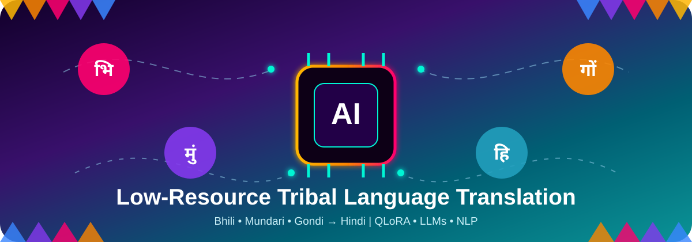
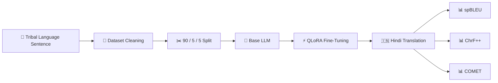

<p align="center">
  
</p>
<h1 align="center">🌍 Low-Resource Tribal Language → Hindi Translation</h1>
<p align="center">
  <b>Preserving linguistic diversity through Artificial Intelligence</b>
</p>
<p align="center">
  Bhili • Mundari • Gondi → Hindi
</p>
<p align="center">
  
  
  
</p>
<p align="center">
  
  
  
</p>
---
## ✨ Project Vision
India has extraordinary linguistic diversity, including many low-resource tribal languages that are underrepresented in modern NLP systems.
This research investigates whether modern multilingual Large Language Models can be efficiently adapted for **tribal-language → Hindi translation** using parameter-efficient fine-tuning.
The current experiments study:
- 🟣 **Bhili → Hindi**
- 🟠 **Mundari → Hindi**
- 🔵 **Gondi → Hindi**
using:
- 🧠 Gemma 3-4B
- 🇮🇳 Sarvam Translate
- ⚡ QLoRA parameter-efficient fine-tuning
- 📊 spBLEU, ChrF++ and COMET evaluation
---
## 🧠 AI × Language × Cultural Diversity
<p align="center">
  
</p>
---
## 🏆 Gemma 3-4B Results
<p align="center">
  
</p>
| 🌐 Language | 🔵 spBLEU | 🟠 ChrF++ | 🟣 COMET | Status |
|---|---:|---:|---:|---|
| **Bhili → Hindi** | **23.2592** | **46.5085** | **0.651306** | ✅ Complete |
| **Mundari → Hindi** | **18.101908** | **32.098273** | **0.564452** | ✅ Complete |
| **Gondi → Hindi** | **14.432006** | **28.800049** | **0.580771** | ✅ Complete |
> 🥇 Bhili currently achieves the strongest overall Gemma translation performance.
---
## 🚦 Experiment Progress
| Model | Bhili | Mundari | Gondi |
|---|:---:|:---:|:---:|
| 🧠 **Gemma 3-4B** | ✅ | ✅ | ✅ |
| 🇮🇳 **Sarvam Translate** | ⏳ | ⏳ | 🔄 |
**Completed:** `3 / 6` model-language experiments
---
## ⚙️ Fine-Tuning Configuration
```yaml
Base Model: google/gemma-3-4b-it
Method: QLoRA
Quantization: 4-bit NF4
Training Steps: 500
Learning Rate: 1e-4
LoRA Rank: 16
LoRA Alpha: 32
LoRA Dropout: 0.05
Seed: 42
Split: 90% Train / 5% Validation / 5% Test
```
### LoRA Targets
```text
q_proj    k_proj    v_proj    o_proj
gate_proj    up_proj    down_proj
```
---
## 🔄 Translation Pipeline

---
## 📊 Evaluation Metrics
### 🔵 spBLEU
SentencePiece-aware BLEU evaluation for multilingual translation quality.
### 🟠 ChrF++
Character and word n-gram F-score that is particularly useful for morphologically rich languages.
### 🟣 COMET
Neural machine-translation evaluation using:
`Unbabel/wmt22-comet-da`
---
## 📁 Repository Structure
```text
MTP_FINAL/
│
├── 00_Master/
│   ├── MTP_FINAL_RESULTS.csv
│   └── Experiment Tracker
│
├── 01_Gemma3_4B_Bhili/
├── 02_Gemma3_4B_Mundari/
├── 03_Gemma3_4B_Gondi/
│
├── 04_Sarvam_Bhili/
├── 05_Sarvam_Mundari/
├── 06_Sarvam_Gondi/
│
├── 07_REPRODUCIBILITY/
│   ├── train_gemma.py
│   ├── inference_gemma.py
│   ├── evaluate.py
│   ├── experiment_config.json
│   ├── requirements.txt
│   └── FILE_HASHES_SHA256.csv
│
└── assets/
    ├── tribal_ai_banner.svg
    └── gemma_results.svg
```
---
## ♻️ Reproducibility
The repository contains reproducibility material for the experiments:
- ✅ exact experiment configuration
- ✅ training scripts
- ✅ inference scripts
- ✅ evaluation scripts
- ✅ dependency versions
- ✅ SHA256 artifact hashes
- ✅ master result table
- ✅ final prediction CSVs where applicable
Large checkpoints and evidence archives are stored separately because of GitHub file-size limitations.
---
## 🔬 Current Research Roadmap
```text
Gemma 3-4B
├── Bhili → Hindi       ✅
├── Mundari → Hindi     ✅
└── Gondi → Hindi       ✅

Sarvam Translate
├── Gondi → Hindi       🔄 Training
├── Mundari → Hindi     ⏳ Next
└── Bhili → Hindi       ⏳
```
---
## 🌱 Motivation
> Every language carries knowledge, culture, identity and history.
This project explores how modern AI can help extend machine translation technology to languages that have historically received far less computational representation.
---
<p align="center">
  <b>🌿 Language × Culture × Artificial Intelligence 🧠</b>
</p>
<p align="center">
  <sub>Low-Resource Tribal Language Translation Research</sub>
</p>
